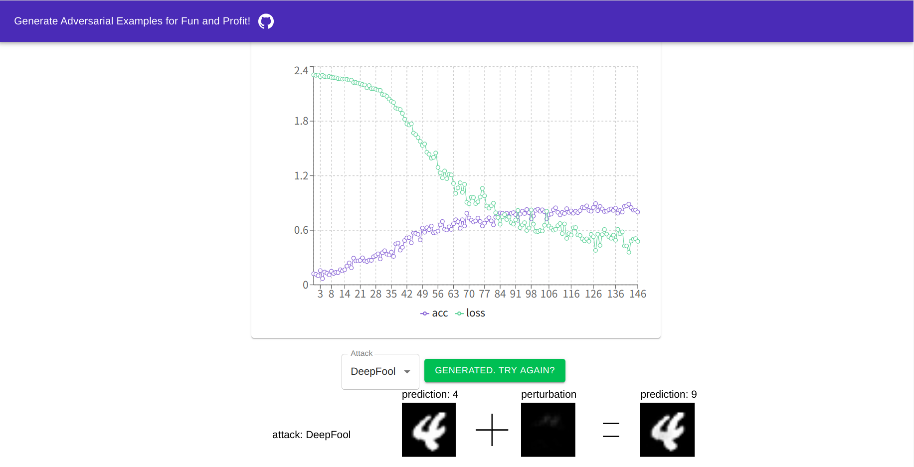

# Adversarial Examples For Fun And Profit
Try to generate adversarial images for fun and profit. 



## What is this
You can generate adversarial images _in your browser_ by the power of tensorflow.js.

~~Demo: https://adv-examples-fun.netlify.com/~~

Currently down. Sorry.

Attention! The above site is heavy. If you see a blank page, reload your browser.

## Attacks
Currently, you can try the below attaks.
- FGSM
- DeepFool
- NewtonFool

## Issues
Currently, the implementation of DeepFool attack is slightly modified from the original paper. This is because I found that the denominator of some formulas can be so small that the perturbation is too big. I am investigating this issue.

## References
FGSM is described by
```
@misc{goodfellow2014explaining,
    title={Explaining and Harnessing Adversarial Examples},
    author={Ian J. Goodfellow and Jonathon Shlens and Christian Szegedy},
    year={2014},
    eprint={1412.6572},
    archivePrefix={arXiv},
    primaryClass={stat.ML}
}.
```

DeepFool is described by
```
@misc{moosavidezfooli2015deepfool,
    title={DeepFool: a simple and accurate method to fool deep neural networks},
    author={Seyed-Mohsen Moosavi-Dezfooli and Alhussein Fawzi and Pascal Frossard},
    year={2015},
    eprint={1511.04599},
    archivePrefix={arXiv},
    primaryClass={cs.LG}
}.
```

NewtonFool is described by
```
@inproceedings{10.1145/3134600.3134635,
author = {Jang, Uyeong and Wu, Xi and Jha, Somesh},
title = {Objective Metrics and Gradient Descent Algorithms for Adversarial Examples in Machine Learning},
year = {2017},
isbn = {9781450353458},
publisher = {Association for Computing Machinery},
address = {New York, NY, USA},
url = {https://doi.org/10.1145/3134600.3134635},
doi = {10.1145/3134600.3134635},
booktitle = {Proceedings of the 33rd Annual Computer Security Applications Conference},
pages = {262–277},
numpages = {16},
keywords = {Adversarial Examples, Machine Learning},
location = {Orlando, FL, USA},
series = {ACSAC 2017}
}.
```

`src/utils/data.ts`, `src/utils/model.ts` and `src/sagas/index.ts` contain the modified version of the code from [TensorFlow.js Example: Training MNIST](https://github.com/tensorflow/tfjs-examples/tree/master/mnist). The license file is `LICENSE.original`.
## Author
Catminusminus
